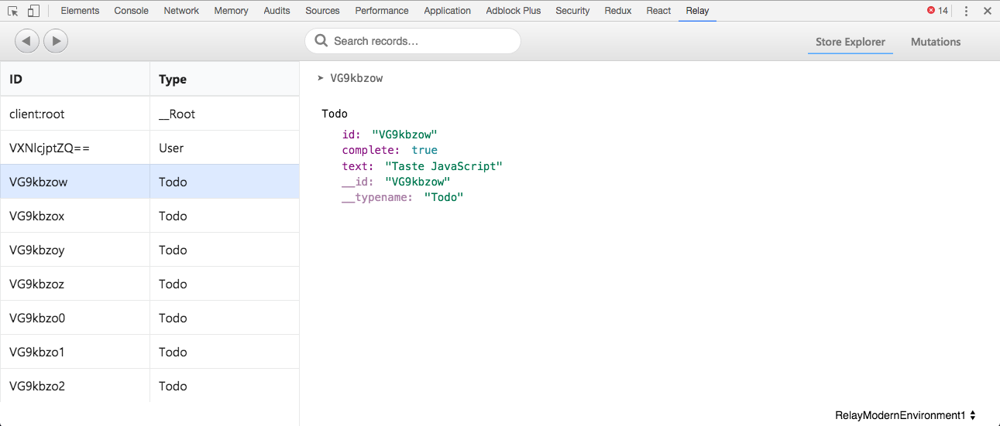
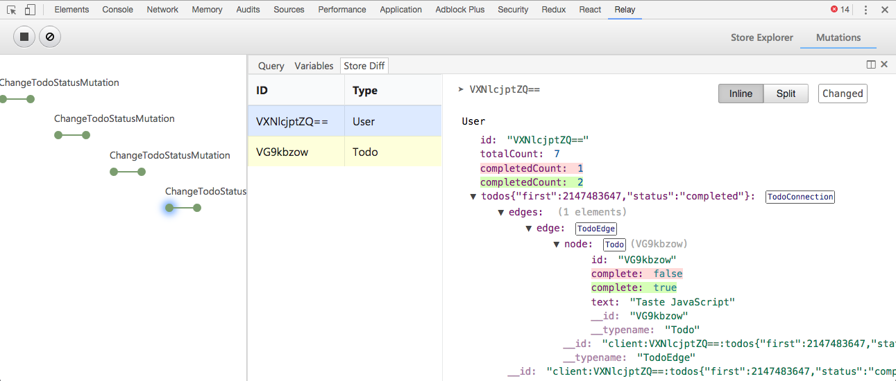

# Relay DevTools

Tooling to debug your Relay apps on web and React Native during development.

## Installation

For Google Chrome, install the [extension from WebStore][0].
After installation "Relay" tab will be available in the Chrome developer tools
apps using Relay are inspected.

For inspecting Relay outside of Chrome, such as in Safari or React Native,
use the standalone Relay DevTools app.

```bash
npm install -g relay-devtools
```

Install Relay DevTools into your application somewhere before a Relay
Environment is created. Don't forget to remove DevTools when you release to
production!

```js
const {Environment} = require('relay-runtime');
const {installRelayDevTools} = require('relay-devtools');

installRelayDevTools();

new Environment(...);
```

Run the Relay DevTools standalone app from the terminal, and it will connect
to your running Relay application.

```bash
relay-devtools
```

[0]: https://chrome.google.com/webstore/detail/relay-devtools/oppikflppfjfdpjimpdadhelffjpciba

## Usage

You can inspect the current state of Relay Store by viewing records from the
store and expanding their connections.



In addition to that, you can record all update events happenning to the store
and inspect how they changed the store.



## Development

Start the webpack devserver to run the app against mock data.
Then navigate to `localhost:3000`.

```
yarn start
```

### Extension

Build a Chrome Extension build. The extension output will be placed to the
extension folder.

```
yarn build:chrome
yarn test:chrome
```

### Electron

Build an Electron App build. Compile the app into a single importable file and
then build the shell.
This app is distributed as `relay-devtools` on npm. [npmjs link][1].

[2]: https://www.npmjs.com/package/relay-devtools


```
yarn build:standalone
yarn test:standalone
```
